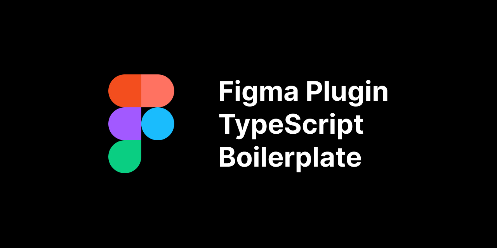

**Figma plugin TypeScript boilerplate to start developing right away.**

[](https://github.com/aarongarciah/figma-plugin-typescript-boilerplate/actions)
[](https://snyk.io/test/github/aarongarciah/figma-plugin-typescript-boilerplate?targetFile=package.json)
[](https://github.com/prettier/prettier)

## Quick start

1. Get the boilerplate **choosing one** of these methods:

   - Fork this repo.
   - Execute these commands in your terminal:
     ```bash
     mkdir my-plugin
     cd my-plugin
     npx degit https://github.com/aarongarciah/figma-plugin-typescript-boilerplate
     ```
   - [Download the repo](https://github.com/aarongarciah/figma-plugin-typescript-boilerplate/archive/master.zip) and extract it into your empty plugin folder.

2. Install dependencies

   ```bash
   npm install
   ```

3. Develop 😄
   ```bash
   npm run dev
   ```

> You'll need Node and npm installed to use this boilerplate. It has been tested in Node 10, 11, 12 and 13.

## Development

To develop a Figma plugin you need to install the Figma [desktop app](https://www.figma.com/downloads/). Learn more in the [Figma Plugin docs](https://www.figma.com/plugin-docs/setup/).

### Available commands:

- `npm run dev`: starts the watcher for changes. Modify the files under the `src` folder and the code will be compiled automatically. Then, go to the Figma app and run your development plugin.
- `npm run build`: generates the production build in the `dist` folder. Important: run this command before releaseing a new version of your plugin. Before generating the build, it checks TypeScript, JavaScript and CSS files for linting errors.
- `npm run test`: runs tests via Jest. This script runs before `build`.
- `npm run test:watch`: runs tests via Jest in watch mode.
- `npm run lint`: lint TypeScript and JavaScript files with ESLint and CSS with Stylelint.
- `npm run lint:fix`: lint and apply automatic fixes to TypeScript, JavaScript and CSS files. This script runs before `build`.

## What this boilerplate does for me?

> It's highly recommended to take a look at the [Figma plugin development docs](https://www.figma.com/plugin-docs/intro/) before developing a plugin.
>
> A plugin has [two parts](https://www.figma.com/plugin-docs/how-plugins-run/): a mandatory worker file (a JavaScript file which has access to the Figma document) and an optional UI (an HTML file).

- Compiles TypeScript.
- Inlines JS and CSS code into the HTML for the UI. That's because the Figma plugin UI must be a unique HTML file and can't reference any other assets like CSS or JS with relative paths. You can load any external asset (e.g. a file hosted in a CDN) but not relative paths.
- Provides setup and config for: TypeScript, webpack, ESLint, Stylelint, Prettier, Jest, EditorConfig, etc.
- Lints and formats the code in a pre-commit hook.
- Provides boilerplate to send messages between the worker and the UI.
- Contains a helper to close the UI if you hit the <kbd>ESC</kbd>. The UI won't be closed if an input is focused.
- Testing environment configured with Jest. Every test file under a `__tests__` folder or ending with `.spec.*` or `.test.*` will be picked up by Jest.
- Contains a GitHub action to build and test the production build.

---

## Having problems?

Take a look if someone already opened [a similar issue](https://github.com/aarongarciah/figma-plugin-boilerplate/issues?utf8=%E2%9C%93&q=is%3Aissue+sort%3Aupdated-desc+) or open a [new one](https://github.com/aarongarciah/figma-plugin-boilerplate/issues/new).

---

## Roadmap

- [ ] Add FAQ to README.
- [ ] Add bin executables to create templates via `npx`.

---

Made with ♥️ by [Aarón García Hervás](https://twitter.com/aarongarciah)
